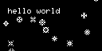

# 2019 (special) Snowflake thing

## ESP32 + SSD1305 Oled (Heltec)

**But first, let me show a screenshot**:



**Prerequistes:**

- RAMDISK mounted at `/Volumes/ramdisk[number]`
  Example (8GB ramdisk):
  ```
  diskutil erasedisk apfs tempramdisk$RANDOM $(hdiutil attach -nomount ram://$((1024*1024*8)))
  ```
- Arduino Application
- MacOS X (macOS)
- Heltec ESP32 (v1 and v2 are ok)


**Usage:**

Run command `make` to upload and connect to `serial` device.
You can override these variables according to your needs:

- `PORT`: `/dev/cu.[your_port_name]`, replace it with your board's
- `BAUD`: `115200`, match it with the code (for monitoring purposes)
- `BUILD`: Temporary build location, you can use `mktemp -d`
- `ARDUINO`: Full path to your arduino binary. Including `./Content/MacOS/Arduino`.

```
compile : compiles sources into `BUILD`.
upload  : compiles then uploads into `PORT`.
monitor : `cat`s device in given `PORT` with `BAUD`.
images  : generate header files from `.bmp` bitmap images.
ss.bmp  : pull screenshot from device.
```

**Explanation of which file do what:**

- `snowflake-esp32.ino`: ESP32 Application for Arduino.
- `bitmap.h`: Bitmap file and `BMP` format definitions, helper functions.
- `screenshot.cc`: Reads `0`s and `1`s from input and converts them
  to bitmap with given sizes as arguments.
- `convert.cc`: Reads bitmaps `BMP` files from input and converts them to
  C array. Note: C array does not have a name, its just HEX body.
  See `snowflake-esp32.ino` for example usage.

**Credits:**

- Icons/Snowflakes are taken from Adafruit:
  https://learn.adafruit.com/neopixel-matrix-snowflake-sweater?view=all
  Note: I took screenshot of screenshot (damn yeah!) and shrunk them to 8x8 using GIMP
  Then modified Levels/Curves to make them more black-white.

---

Note: Pulling screenshot from device may 'freeze' screen for a second :)
